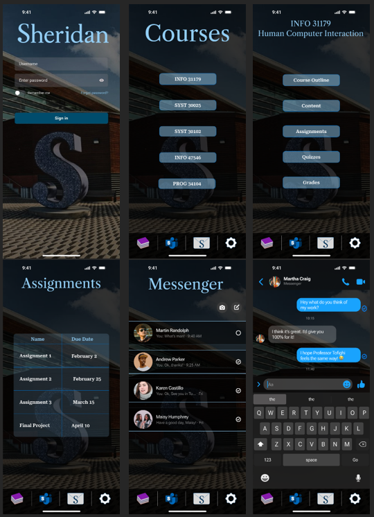

# HCI-Assignment-2
Prototype for a Sheridan College app. This app allows students to check on their coursework and communicate with other students and faculty via Sheridan Email or the built-in messaging service.

## Application Versions

1. [Version 1](https://www.figma.com/file/JgObWh6Qj19fzt5Ikf3k3q/Assignment-1?type=design&node-id=0%3A1&mode=design&t=lRyODStvkEaWL1R1-1)
2. [Version 2](https://www.figma.com/file/DM7z1ZhvToj9B8I2L5HWfi/Assignment-2?type=design&node-id=27%3A623&mode=design&t=1zoarrS7GLqH2pE9-1)

## About

For students that don't always have access to a computer and need to access their information on the go. The Sheridan College app is designed to make life easier for students.

## Features

- Login
- View SLATE Course Outlines, Content, Assignments, Quizzes, and Grades
- Access your Sheridan email
- Message students and faculty through the built-in messaging service.
- Clean and modern user interface!

## Initial Prototype

## Final Prototype

## Demo Video

Watch the video [here](https://youtu.be/1CbAwSATc9E)

## Future Planning

We would like to implement the following functionalities. We found that these were not in the top 5 apps that we reviewed. Adding these to our product will make it far more competitive.

| Issue                                                            | Proposed Solution                                                                                                                                                               |
| ---------------------------------------------------------------- | ------------------------------------------------------------------------------------------------------------------------------------------------------------------------------- |
| Need to upload an assignment from the cloud without a computer   | Add the option to upload files to Assignments from either mobile device storage or connected cloud services                                                                     |
| Can't add or drop courses without a computer                     | Add access to myStudentCentre from the app through a separate page                                                                                                              |
| Need to join online class session without a computer             | Provide access to classes held in Virtual Classroom, WebEx, and Microsoft Teams through Courses page                                                                            |

## Links

- [Github Repository](https://github.com/HasanYousaf/HCI-Assignment-2)
- [Figma Public Link](https://www.figma.com/file/DM7z1ZhvToj9B8I2L5HWfi/Assignment-2?type=design&node-id=27%3A623&mode=design&t=1zoarrS7GLqH2pE9-1)
- [Video Demo](https://youtu.be/1CbAwSATc9E)
